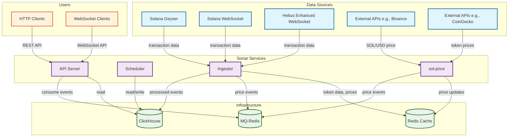

# Sonar

Sonar is a high-performance, modular indexing and analytics platform for the Solana blockchain. It captures, processes, and serves real-time data from on-chain activities, with a primary focus on token swaps and liquidity pools.

## ✨ Features

- **High-Performance Ingestion**: Connects directly to a Solana Geyser plugin for low-latency data capture.
- **Modular & Scalable**: Services like ingestion, API, and scheduling are separated into independent crates, allowing them to be scaled separately.
- **Multi-Protocol DEX Support**: Includes processors for a wide range of DEX protocols on Solana (Raydium, Orca, Meteora, etc.).
- **Real-time Data**: Provides real-time access to swaps, token prices, and candlestick data.
- **Extensible Storage**: Designed to work with different database backends like ClickHouse.

## 🏗️ Architecture

The system is composed of several key services that communicate via a message queue (e.g., Redis).



### Core Components

- **Ingestor (`crates/ingestor`)**: The heart of the system. Connects to Geyser, filters for relevant transactions, parses them, and publishes them to the message queue.
- **Scheduler (`crates/scheduler`)**: Consumes messages from the queue and performs scheduled tasks, such as aggregating data for candlesticks or updating token information.
- **Storage (`crates/storage`)**: Provides a database abstraction layer, currently focused on ClickHouse for time-series data.
- **API (`crates/api`)**: A web server (Axum) that exposes processed data via a RESTful API and WebSocket streams.
- **CLI (`bin/`)**: A command-line interface to manage and run the different services.

## 🚀 Getting Started

### Prerequisites

- **Rust**: See [rust-toolchain.toml](./rust-toolchain.toml) for the exact version.
- **Docker**: For running dependent services like Redis and ClickHouse.
- **Solana Geyser Plugin**: You need access to a Solana node with the Geyser plugin enabled.
- **Solana RPC**: You need access to a Solana RPC endpoint.

### 1. Installation

First, clone the repository:

```bash
git clone https://github.com/phcxc/sonar.git
cd sonar
```

### 2. Configuration

Copy the example environment file and fill in the required values, especially the database and RPC endpoint URLs.

```bash
cp .env.example .env
```

### 3. Build

Build the project in release mode:

```bash
cargo build --release
```

### 4. Running the Services

Each service can be run using the main `sonar` binary. You will need to run each command in a separate terminal.

**Start the API Server:**
```bash
cargo run -p sonar api
```

**Start the Ingestor (Node):**
```bash
cargo run -p sonar node
```

**Start the Scheduler:**
```bash
cargo run -p sonar scheduler
```

## 🤝 Contributing

Contributions are welcome! Please feel free to submit a pull request or open an issue. We recommend following these steps:

1.  Fork the repository.
2.  Create a new branch (`git checkout -b feature/my-new-feature`).
3.  Make your changes.
4.  Commit your changes (`git commit -am 'Add some feature'`).
5.  Push to the branch (`git push origin feature/my-new-feature`).
6.  Open a new Pull Request.

For more detailed guidelines, please see our (upcoming) `CONTRIBUTING.md` file.

## 📄 License

This project is licensed under the MIT License. See the [LICENSE](./LICENSE) file for details.

## 💡 Inspiration

This project is inspired by projects like [piotrostr/listen](https://github.com/piotrostr/listen).

## 📚 References

- [solana-etl](https://github.com/blockchain-etl/solana-etl)
- [piotrostr/listen](https://github.com/piotrostr/listen)
- [carbon](https://github.com/sevenlabs-hq/carbon)
- [yellowstone-vixen](https://github.com/rpcpool/yellowstone-vixen)