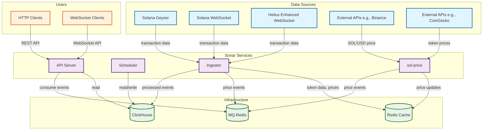

# Sonar

<p align="center">
  <a href="https://github.com/sola-hq/sonar/actions/workflows/lint.yml">
    
  </a>
  <a href="https://github.com/sola-hq/sonar/blob/main/LICENSE">
    
  </a>
  <a href="https://github.com/sola-hq/sonar">
    
  </a>
</p>

<h3 align="center">
  A high-performance, open-source data platform for the Solana ecosystem.
</h3>

---

Sonar is a modular indexing and analytics platform for the Solana blockchain. It does the heavy lifting of capturing, processing, and serving real-time and historical on-chain data, so you can focus on building your application.

## 🤔 Why Sonar?

Accessing reliable, low-latency, and comprehensive DeFi data on Solana is complex and expensive. Sonar solves this by providing a self-hosted, open-source solution that is both powerful and flexible.

**Who is this for?**

*   **DeFi Developers**: Build sophisticated applications on top of a solid data foundation.
*   **Data Analysts & Researchers**: Query rich, granular historical data to uncover market insights.
*   **Arbitrageurs & MEV Searchers**: Get a real-time firehose of on-chain events to feed your trading strategies.
*   **Infrastructure Providers**: Offer reliable data endpoints as a service to your users.

## ✨ Features

- **High-Performance Ingestion**: Connects directly to a Solana Geyser plugin for microsecond-level data capture.
- **Modular & Scalable**: Services for ingestion, API, and scheduling are independent crates, allowing them to be scaled separately.
- **Multi-Protocol DEX Support**: Includes processors for a wide range of DEX protocols on Solana (Raydium, Orca, Meteora, etc.).
- **Real-time & Historical Data**: Provides WebSocket streams for live data and a REST API for historical queries.
- **Extensible by Design**: Easily add support for new protocols or data types.

## 🚀 Getting Started

### Prerequisites

- **Rust**: See [rust-toolchain.toml](./rust-toolchain.toml) for the exact version.
- **Docker**: For running dependent services like Redis and ClickHouse.
- **Access to Solana Data**:
    - For full, low-latency performance: A Solana node with the [Geyser plugin](https://solana.com/docs/rpc/geyser-plugins).
    - For basic functionality and development: A standard Solana RPC endpoint.

### 1. Clone the Repository

```bash
git clone https://github.com/sola-hq/sonar.git
cd sonar
```

### 2. Configure Your Environment

Copy the example environment file. You will need to fill in the required values, especially the database and RPC endpoint URLs.

```bash
cp .env.example .env
```

### 3. Run with Docker Compose (Recommended)

For a simple, one-command setup of all services (including Redis and ClickHouse), we recommend using Docker Compose.

*(Note: A `docker-compose.yml` file is being developed and will be available soon. For now, please run the services manually as described below.)*

### 4. Manual Build & Run

Build the project in release mode:

```bash
cargo build --release
```

Each service can be run using the main `sonar` binary. You will need to run each command in a separate terminal.

**Start the API Server:**
```bash
./target/release/sonar api
```

**Start the Ingestor (Node):**
```bash
./target/release/sonar node
```

**Start the Scheduler:**
```bash
./target/release/sonar scheduler
```

## 🏗️ Architecture

The system is composed of several key services that communicate via a message queue (e.g., Redis).



## 🤝 Contributing

We welcome contributions of all kinds! A great way to start is by looking at our open issues. Please feel free to submit a pull request or open an issue.

For more detailed guidelines, please see our [CONTRIBUTING.md](./CONTRIBUTING.md) file (coming soon!).

## 📄 License

This project is licensed under the MIT License. See the [LICENSE](./LICENSE) file for details.
